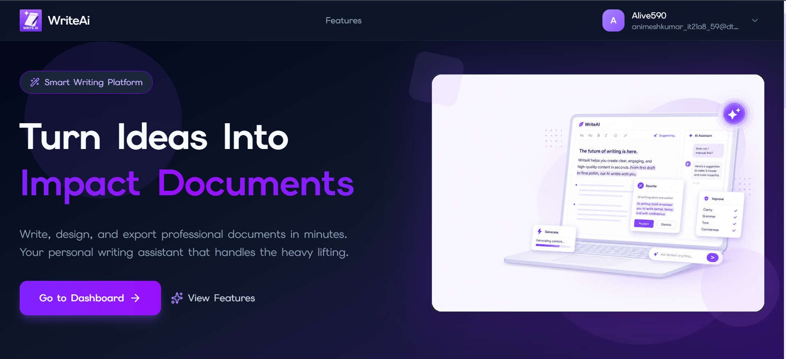
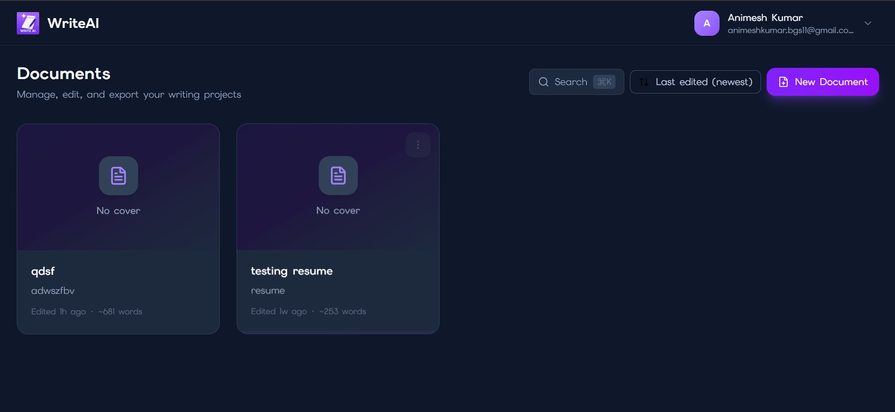
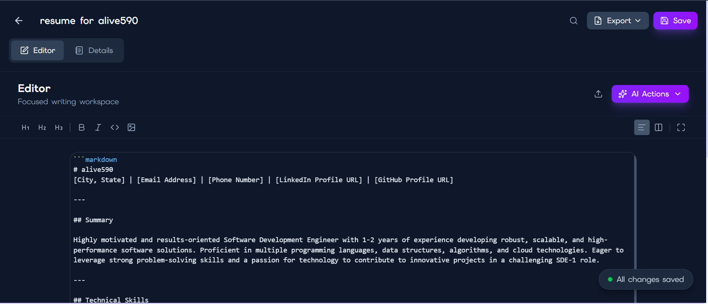
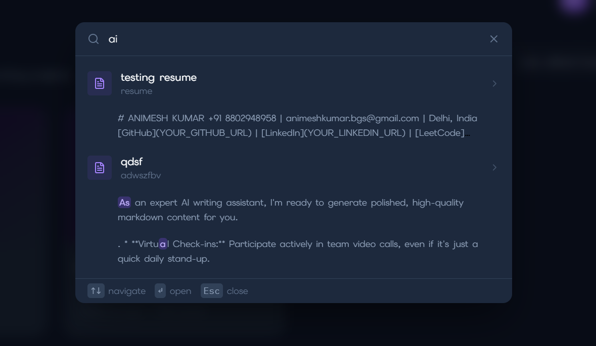

# WriteAI

> AI-powered document editor built on chunk-based storage, streaming generation, and async export jobs.

[](https://writeai-teal.vercel.app)
[](https://github.com/Animesh-kumar23/WriteAI/actions/workflows/ci.yml)
[](https://nodejs.org)
[](https://react.dev)
[](https://mongodb.com)
[](https://redis.io)
[](https://docs.bullmq.io)
[](LICENSE)

**[→ writeai-teal.vercel.app](https://writeai-teal.vercel.app)**



---

## Why I Built This

I wanted to move beyond tutorial CRUD apps and build something that forced me to solve real engineering problems: large-document performance, concurrent edits, async background work, rate limiting, and AI cost control. What started as a simple save-the-whole-document approach kept breaking as documents grew — so I refactored into a chunk-based architecture, added conflict detection, moved exports off the request thread into a job queue, and built rate limiting that degrades gracefully when Redis is unavailable. This project is where I learned what production-oriented backend engineering actually looks like.

---

## Architecture

```
┌──────────────────────────────────────────┐
│           Browser (React 19)            │
│  CodeMirror 6 editor · streamed AI responses │
└───────────────────┬──────────────────────┘
                    │ REST / HTTP streaming
         ┌──────────▼──────────┐
         │    Express 5 API    │
         │  JWT · Helmet · CORS│
         └──┬──────┬──────┬───┘
            │      │      │
   ┌────────▼──┐ ┌─▼────┐ ┌▼───────────────┐
   │  MongoDB  │ │Redis │ │ Gemini 2.5 Flash│
   │  Chunks   │ │Locks │ │    (AI)         │
   │  + Search │ │Quota │ └────────────────┘
   └───────────┘ │Rate  │
                 └──┬───┘
             ┌──────▼──────┐
             │   BullMQ    │
             │Export Worker│
             └──────┬──────┘
                    │ result → Redis (short TTL)
                    ▼
             Browser download
```

Documents are stored as ordered `DocumentChunk` records in MongoDB. The editor tracks which chunks are dirty and sends only those on autosave. Exports run off-thread in a BullMQ worker. Redis handles AI concurrency locks, rate limiting, daily quotas, and temporary export results.

---

## Features

### ✍️ Writing Experience
- CodeMirror 6 markdown editor with live split preview
- Chunk-based autosave — only changed sections are written to the DB
- Save states: saved / saving / dirty / error, with a persistent status bubble
- `Ctrl+S` save shortcut, inline title editing in the header, and a leave-guard (browser close + in-app nav) when there are unsaved changes
- Import PDF or DOCX — text extracted and replaced into chunks; spinner feedback on the action button
- Export to styled PDF or DOCX via background queue; export dropdown locks while a job is in flight
- Full-text search across documents and chunk content
- Dashboard with client-side sort (last edited / created / title), inline rename via a per-card 3-dot menu, and "Edited Nago · ~N words" metadata cached on every save

### 🤖 AI Writing (Gemini 2.5 Flash)
- 8 actions: Generate Draft, Continue, Rewrite, Expand, Shorten, Fix Grammar, Simplify, Custom Prompt
- Streams tokens to the editor in real time via chunked HTTP transfer
- Configurable style, tone, audience, format, and length
- Per-document lock prevents duplicate AI requests across tabs
- Retrieval-augmented context for Continue/Custom Prompt — the most relevant earlier chunks (by embedding similarity, not position) are pulled into the prompt alongside the recent text (opt-in via `RAG_ENABLED`)

### 🏗️ Infrastructure
- Chunk-based document storage with lazy loading in read view
- Version-per-chunk conflict detection — 409 on mismatch, resolution modal in UI
- Background export jobs (BullMQ) — non-blocking, retryable, cached in Redis
- Multi-tier rate limiting: global, per-user, AI-specific, export-specific
- Daily AI quota with automatic UTC midnight reset
- Atlas Search with fuzzy matching (regex fallback in dev)
- ZIP bomb detection on DOCX import
- Graceful degradation when Redis is unavailable

---

## Screenshots

### Dashboard — document library with AI-assisted creation


### Editor — markdown editing with streaming AI actions


### Search — fuzzy search across document titles and chunk content


---

## Engineering Challenges

### Chunk-based document architecture

The naive approach writes the entire document on every save. For long documents, that's wasteful — and it gets worse as documents grow. I split documents into ordered chunks with a `DocumentModel` class on the client that tracks which chunks are dirty. On autosave, only the changed chunks are sent in a single batch request. Clean separation between "what changed" and "what didn't."

### Concurrent edit conflict detection

Every chunk carries a version counter. When the client saves, it sends the version it last saw for each chunk. The server does a conditional update: if the server version no longer matches, the update fails and a 409 is returned with the conflicted chunk data. The editor shows a modal — "Keep Mine" forces an overwrite, "Use Server" resets the editor to the server state. Conflicts are resolved at the chunk level, not the full document.

While writing an integration test for stale chunk versions, the suite exposed an incorrect conflict-classification path: a chunk exactly one version ahead could be mistaken for a successful update. I fixed the classifier, added regression coverage that verifies the server returns 409 without overwriting its content, and introduced CI so the same concurrency behavior is validated on every pull request.

### Background export jobs

PDF and DOCX generation is slow — parsing markdown, rendering fonts, embedding images. Running that on the request thread would block the API. I moved it into a BullMQ worker: the client gets a job ID immediately, then polls for status. When the worker finishes, it stores the result in Redis with a short TTL. The client fetches it for download. Jobs retry with exponential backoff on failure.

### AI concurrency control

Submitting the same AI request twice wastes API quota and creates race conditions in the editor. Before each Gemini call, the server acquires a Redis lock scoped to user + document. If the lock already exists, the request is rejected with 409. The lock expires automatically if the stream crashes, so it never gets permanently stuck. Users can still run AI generation on two different documents simultaneously.

While extending this lock to also cover retrieval work (below), I found a real bug in it: the original implementation stored a plain `"1"` and released the lock with an unconditional `DEL`. If a request ran long enough for its TTL to expire while a second request legitimately acquired the same key, the first request's cleanup would delete the second request's active lock — one request releasing a lock it doesn't own. I fixed this by giving each acquisition a unique token and releasing only via an atomic Redis Lua script that compares the token before deleting.

### Context-aware generation (RAG)

"Continue" and "Custom Prompt" only ever saw the last three chunks of a document — a positional heuristic, not a relevance one. For a long document, the part that actually matters (a defined term, an established argument) can easily be outside that window, and the model has no way to see it.

Since documents are already split into `DocumentChunk` records for autosave, those chunks turned out to be a reasonable retrieval unit for free. On a `continue`/`custom` request, the server embeds the candidate chunks (Gemini's `gemini-embedding-001` — chosen specifically because it returns one embedding per input string in a batch request, which is what the batching here relies on) and ranks them against the current context by cosine similarity, computed directly rather than through a vector database — the candidate pool is small enough that brute-force ranking is the honest, simple option. Candidates are drawn from the 30 most recent saved chunks only; this is a real scope limit, not full-document search, and an older chunk is never a retrieval candidate in v1. The top matches are spliced into the prompt as explicitly-labeled, untrusted reference material, alongside (not instead of) the existing recency-based context. Ownership of the source document is re-verified on the server for every retrieval, independent of any other check, since the document ID driving it is client-supplied. Embeddings are normally reused from a Redis cache keyed by content hash, model, dimensionality, and task type, rather than recomputed on every request — though a cache miss still happens if Redis is unavailable, an entry expires, or the model changes, so "normally cached" is the accurate claim, not "never recomputed." If retrieval or embedding fails for any reason, the request falls back to ordinary generation without retrieved context rather than failing the whole request.

The feature ships disabled by default (`RAG_ENABLED=false`) and is enabled per-environment after manual verification, rather than turning itself on the moment the code deploys.

### Security

| Threat | Mitigation |
|---|---|
| Path traversal | `coverImage` and `avatar` are only writable via dedicated multer upload endpoints — never via JSON body |
| Prompt injection | All AI config fields are sanitized (HTML stripped, length-capped) before insertion into Gemini prompts |
| CSRF | CORS origin whitelist + JSON-only request bodies (form-based attacks can't replicate `application/json`); `httpOnly` cookie prevents XSS token theft |
| XSS | `rehype-sanitize` in markdown preview; `escapeHtml` runs before all renderer substitutions |
| Zip bomb on import | `adm-zip` checks uncompressed entry sizes before parsing — oversized archives are rejected |
| NoSQL injection | All Mongoose queries use typed parameters; malformed ObjectIds return 400 before hitting the DB |

---

## What I Learned

Building WriteAI taught me how quickly simple architectures break under real usage.

The biggest lessons:
- Naive full-document saves don't scale — granular writes matter
- Background jobs are necessary for any work that takes more than a second
- Concurrency bugs appear fast when autosave, AI generation, and multiple tabs run simultaneously
- Rate limiting and cost controls are first-class requirements in AI products, not afterthoughts

---

## Tech Stack

| Layer | Tech |
|---|---|
| Frontend | React 19, Vite 7, Tailwind CSS 4, CodeMirror 6, Axios |
| Backend | Node.js, Express 5, Mongoose 8 |
| Database | MongoDB (Atlas in prod) |
| Queue | BullMQ |
| Cache / Locks | Redis (Redis Cloud in prod) |
| AI | Google Gemini 2.5 Flash (generation), `gemini-embedding-001` (retrieval) |
| Export | PDFKit, docx |
| Import | Mammoth, pdf-parse |
| Auth | JWT, bcryptjs |
| Security | helmet, express-rate-limit, multer |
| Infra | Vercel (frontend), Render (backend) |

---

## Getting Started

**Prerequisites:** Node.js 20+, MongoDB, Redis (optional — features degrade gracefully without it)

```bash
git clone https://github.com/Animesh-kumar23/WriteAI.git
cd WriteAI
```

### Backend

```bash
cd backend
cp .env.example .env   # fill in DB_URI, JWT_SECRET_KEY, GEMINI_API_KEY
pnpm install
pnpm dev
```

### Frontend

```bash
cd frontend
cp .env.example .env   # set VITE_API_BASE_URL=http://localhost:3000
pnpm install
pnpm dev
```

### Environment Variables

**`backend/.env`**

| Variable | Required | Notes |
|---|---|---|
| `DB_URI` | ✅ | MongoDB connection string |
| `JWT_SECRET_KEY` | ✅ | JWT signing secret |
| `GEMINI_API_KEY` | ✅ | Google AI key |
| `CLIENT_URL` | ✅ | Comma-separated frontend origins for CORS |
| `REDIS_URL` | No | Enables rate limiting, locks, and export cache |
| `AI_DAILY_LIMIT` | No | Max AI calls per user per day (default: 100) |
| `ATLAS_SEARCH_ENABLED` | No | `true` to use fuzzy Atlas Search in prod |
| `RAG_ENABLED` | No | `true` to enable retrieval-augmented context for Continue/Custom Prompt (default: off) |
| `EMBEDDING_MODEL` | No | Gemini embedding model for retrieval (default: `gemini-embedding-001`) |

**`frontend/.env`**

| Variable | Required | Notes |
|---|---|---|
| `VITE_API_BASE_URL` | ✅ | Backend URL (e.g. `http://localhost:3000`) |
| `VITE_SHOW_CONTACT_INFO` | No | `true` to show real contact details in footer |

---

## Testing

WriteAI includes 33 focused frontend and backend automated tests covering document authorization, chunk-level optimistic-concurrency conflicts, Redis-based AI locks and quotas, BullMQ export queueing, autosave race conditions, streamed AI responses, and RAG retrieval (ownership checks, cache and embedding-budget behavior, malformed-vector handling, and the token-based AI lock).

The test stack includes Vitest, Supertest, React Testing Library, an isolated MongoDB test database, and an isolated Redis test database. GitHub Actions runs the test suites, frontend linting, and the production build on pushes and pull requests.

```bash
docker compose up -d mongo redis
pnpm --dir backend test
pnpm --dir frontend test
pnpm --dir backend test:coverage
pnpm --dir frontend test:coverage
```

Coverage commands and instructions for adding tests are in **[TESTS.md](TESTS.md)**. Deployment remains handled by the existing hosting integrations.

---

## Deployment

The frontend and backend are deployed separately:

| Service | Platform | URL |
|---|---|---|
| React frontend | [Vercel](https://vercel.com) | [writeai-teal.vercel.app](https://writeai-teal.vercel.app) |
| Express API | [Render](https://render.com) | writeai-1jcj.onrender.com |

The backend is API-only (no static file serving). CORS allows both Vercel origins. A `render.yaml` Blueprint is included in the repo root for one-click Render deploy.

---

## Project Structure

```
writeai/
├── backend/src/
│   ├── configs/       # db, redis, env, genai
│   ├── controllers/   # auth, documents, ai, exports, import, search, profile
│   ├── middlewares/   # auth, upload, rateLimit, aiQuota
│   ├── models/        # User, Document, DocumentChunk
│   ├── queues/        # export.queue.js (BullMQ)
│   ├── services/      # retrieval.js (RAG)
│   ├── workers/       # export.worker.js
│   ├── routes/
│   └── utils/         # pdf.generator, docx.generator, import.parser, documentChunks, aiLock
│
└── frontend/src/
    ├── components/    # edit-document, document-view, home, ui
    ├── contexts/      # AuthContext, ThemeContext
    ├── hooks/         # useDocumentEditor, useDocumentChunks, useSearch
    ├── lib/           # documentModel.js, aiStream.js, axios.js
    └── pages/         # Dashboard, EditDocument, Document, Landing, Profile, Auth
```

---

## License

[Apache 2.0](LICENSE)

Initial data models and auth scaffolding were adapted from [Imprintly](https://github.com/KeepSerene/imprintly-ai-e-book-creator-mern) (Apache 2.0). Substantially modified: chunk-based storage, optimistic concurrency control, streaming AI generation, Redis locking, background export jobs, and retrieval were built for this project.
